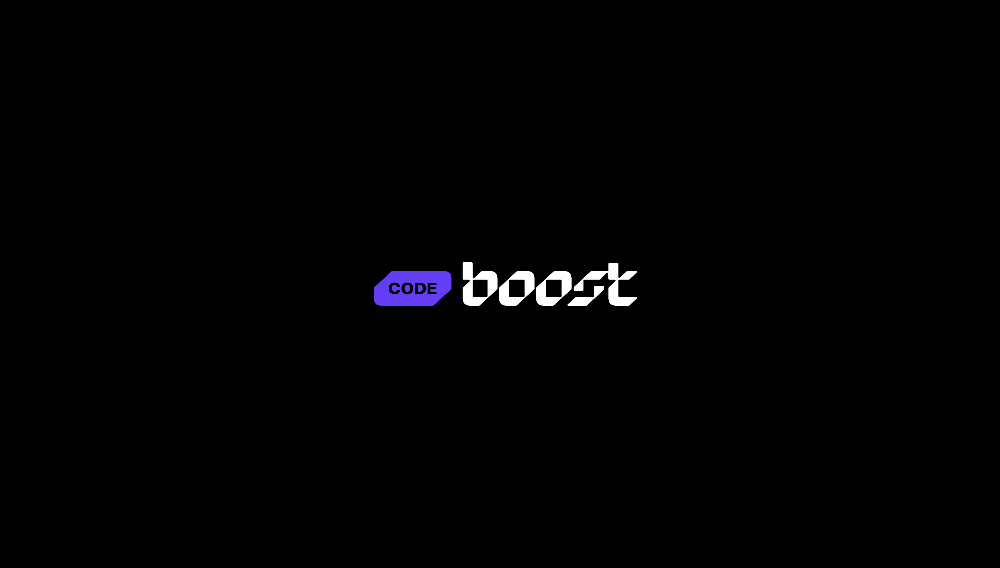

<h1> Codeboost - Blog </h1>
<h2> Primeira parte do Projeto Blog Codeboost. </h2>
  
PT - O Blog é um dos módulos do curso de Front-end do Codeboost. A primeira parte deste projeto é utilizar HTML | CSS | JAVASCRIPT. A segunda parte (em andamento) é colocar o blog em funcionamento no WORDPRESS. 
    EN - The Blog is one of de modules of Codeboost's Front-end course. The first part is about HTML | CSS | JAVASCRIPT. The second part (in progress) is to get the blog up and running on WORDPRESS. 

